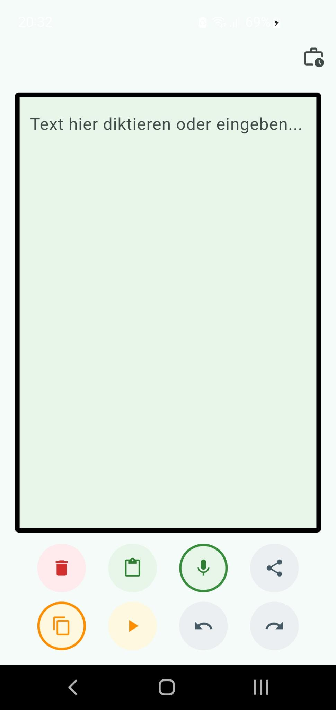
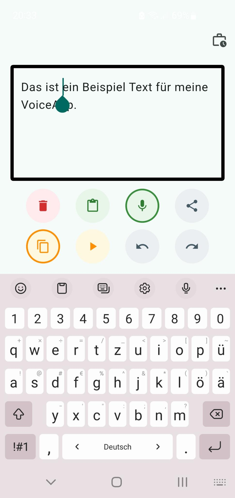
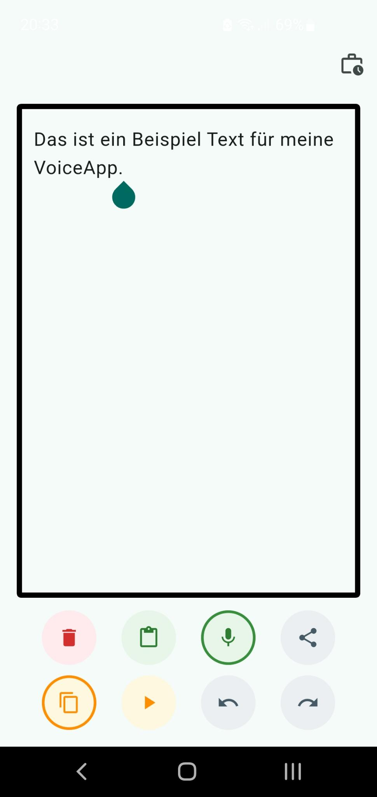

# VoiceApp – Diktieren & Vorlesen

Eine schlanke, werbefreie Android-App zum Diktieren und Vorlesen von
Text. Kein Konto, kein Tracking, keine Cloud-Pflicht – läuft über die
Sprach-Funktionen deines Geräts.

## Funktionen

- Text per Spracheingabe diktieren (auch am Cursor einfügen, nicht nur
  am Textende)
- Beliebigen Text vorlesen lassen
- Rechtschreibprüfung während der Eingabe (nutzt die native
  Android-Rechtschreibprüfung)
- Automatische Großschreibung nach Satzzeichen
- Gesprochene Satzzeichen ("Komma", "Punkt", "Fragezeichen" ...) werden
  als echte Zeichen eingefügt
- Text bearbeiten, kopieren, einfügen, teilen
- Rückgängig/Wiederholen
- Text bleibt beim Schließen der App erhalten (lokal gespeichert)
- Einbindung ins Android-Textauswahlmenü ("Mit VoiceApp vorlesen")

## Datenschutz

Die App speichert Texte ausschließlich lokal auf dem Gerät. Es gibt
keine Werbung, keine Analyse-Tools und keine Datenweitergabe an Dritte.
Details siehe [PRIVACY.md](./PRIVACY.md).

## Screenshots





## Technik

Gebaut mit [Flutter](https://flutter.dev). Verwendete Pakete:

- [`speech_to_text`](https://pub.dev/packages/speech_to_text) – Diktierfunktion
- [`flutter_tts`](https://pub.dev/packages/flutter_tts) – Vorlesefunktion
- [`share_plus`](https://pub.dev/packages/share_plus) – Teilen-Funktion
- [`shared_preferences`](https://pub.dev/packages/shared_preferences) – lokales Speichern des Texts

Spracherkennung und Sprachausgabe laufen über die auf dem jeweiligen
Android-Gerät installierten System-Engines (nicht Teil dieser App).

## Selbst bauen

Voraussetzung: [Flutter SDK](https://flutter.dev/docs/get-started/install)
installiert.

```bash
git clone https://github.com/DEIN-NUTZERNAME/voiceapp.git
cd voiceapp
flutter pub get
flutter run
```

Release-APK bauen:

```bash
flutter build apk --release
```

Die fertige Datei liegt danach unter
`build/app/outputs/apk/release/app-release.apk`.

## Berechtigungen

| Berechtigung | Wofür |
|---|---|
| Mikrofon | Diktierfunktion |
| Internet | technische Voraussetzung des Spracherkennungs-Pakets |

## Mitmachen

Fehler gefunden oder eine Idee für eine Verbesserung? Gerne ein
[Issue](https://github.com/falkojana/voiceapp/issues) eröffnen
oder einen Pull Request einreichen.

## Lizenz

[MIT](./LICENSE) – frei nutzbar, veränderbar und weiterverteilbar.

## Kontakt

Bei Fragen: fotosort.app@gmail.com
